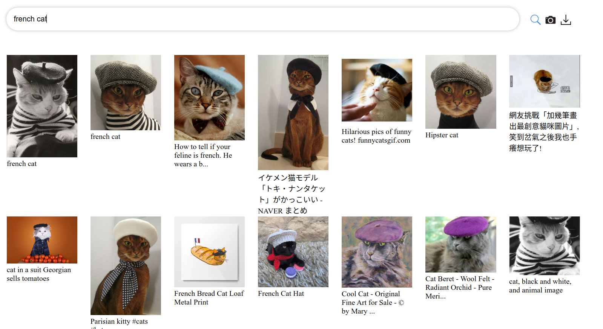

# laion-prepro
Get billions of image+url from the laion datasets and preprocess them.

This repository can be run on
* for laion400m one machine with 32GB of ram, 8TB of disk, 16 i7 core and a 1Gbps connection.
* laion5B 10 machines similar to the laion400m one

## What is laion ?

The laion project has for objective to use commoncrawl to retrieve billions of aligned image+text pairs.
It is composed of a central server that track the progress of decentralized (run by anyone) workers that process small chunks of commoncrawl.
Currently, 5B such pairs have already been retrieved.
Read more about it at the [laion 400M release post](https://laion.ai/laion-400-open-dataset/)

### What can be done with these dataset ?

Vision and language modeling has been taking off in 2021. Here are some pointers about what this kind of image + text datasets unlocks and why it seems really interesting:

* 6 months ago OpenAI released 2 blogposts and papers clip and dall-e. Both model rely on a large amount of (text, image) pairs. They used an unreleased 400M pairs dataset.
   * CLIP is a model that computes how related are a text and an image. This makes it possible to build large text to image search, and it makes it possible to build that kind of crazy text to image art clip-art . They released a small and medium version of the model but no training code.
   * DALL-E is a model that directly generate images from texts. As can be seen from the blogpost, it achieves very impressive results that could have direct impacts on the world, for anything that need drawing and illustrations. OpenAI did not release any model, even through an API

Since then, several efforts have been organized to replicate DALL-E. People organized initially around this awesome dalle replication repository DALLE-pytorch with some nice results that can be seen in the readme. More recently as part of an huggingface events, new results have been achieved (see dalle mini report ) and an online demo is now available dalle-mini demo

The replication effort is still far from achieving the same performance as the original dalle, and it seems it's possible to go even further. Some people also want to make a better CLIP to produce even better generated art.

A large part of the results that can be achieved with such models is thanks to data. Large amount of data. Before laion 400M, the largest open dataset for (image, text) pairs are in the order of 10M (see DALLE-datasets ), which is enough to train okay models, but not enough to reach the best performance. Having a public dataset with hundred of millions of pairs will help a lot to build these image+text models.

### Visualization of the dataset

Check the [colab](https://colab.research.google.com/drive/14Hc_fUUOrG9260VzD_XsTxWX7f5cptyL?usp=sharing) and the [web demo](https://rom1504.github.io/clip-retrieval/)

## laion5B

laion5B and laion400m processing is overall the same, but laion5B being 10x, it required making everything distributed

Read more at [laion5B/README.md](laion5B/README.md)

## laion400m

See [laion400m/README.md](laion400m/README.md)
